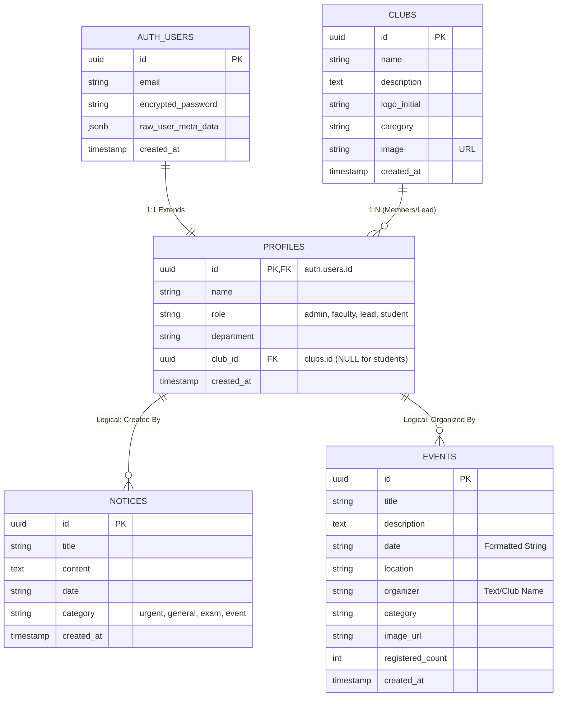
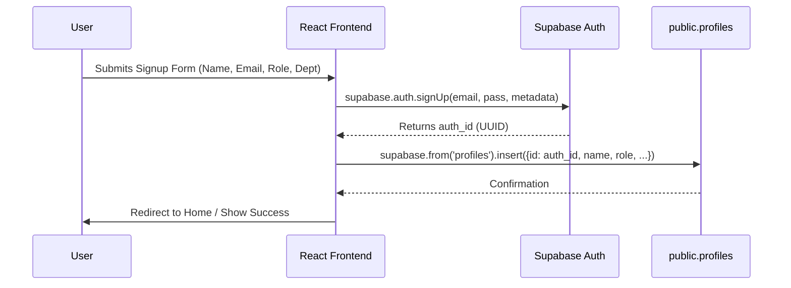
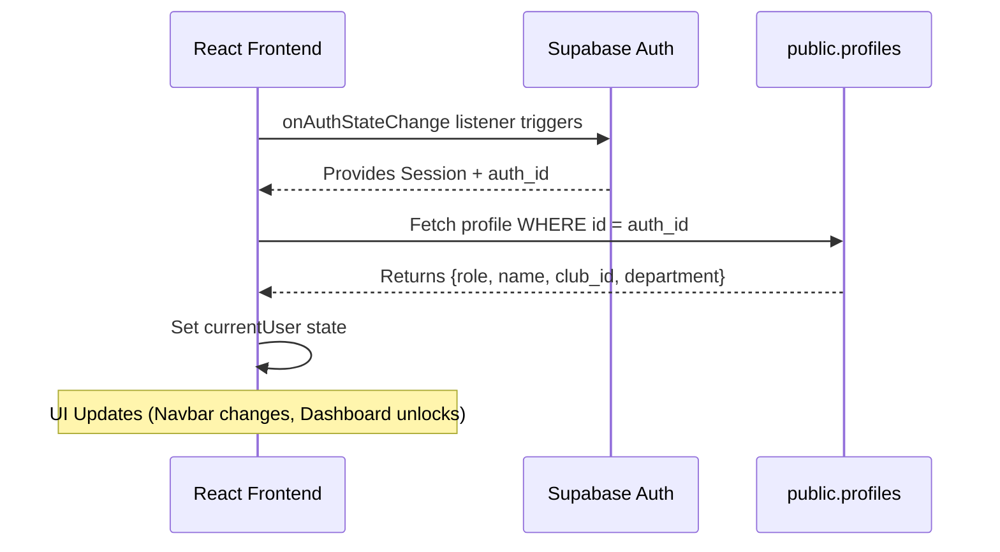

# PEC Portal - Database & Data Flow Architecture

This document provides a technical deep-dive into the relational structure and data movement within the PEC Portal ecosystem.

---

## 1. Entity Relationship (ER) Diagram

The following diagram illustrates the connections between the system-level authentication and the public application tables.

---

## 2. Table Relationships & Logic

### 2.1. The Auth-Profile Link (1:1)
- **Primary Key Mapping:** Every row in `public.profiles` shares the exact same UUID as the corresponding row in `auth.users`.
- **Integrity:** If a user is deleted from the `auth` system, the `profiles` row is typically cleaned up or orphaned depending on the foreign key constraint (`ON DELETE CASCADE`).

### 2.2. The Club-Lead Mapping (1:N)
- **The `club_id` column:** In the `profiles` table, this column is used primarily for users with the `lead` role.
- **Dynamic Membership:** When calculating "Member Count," the application performs a lookup: `SELECT count(*) FROM profiles WHERE club_id = 'XYZ'`. This ensures that even "Student" users can be associated with a club if the UI allows joining.

### 2.3. Event & Notice Ownership (Logical)
- While the database currently stores `organizer` as a `TEXT` field in `events` for simplicity, it is logically derived from the `name` of the club the `lead` belongs to, or the `department` of a `faculty` member.

---

## 3. Data Flow Diagrams

### 3.1. User Registration Flow (Dual-Write)
This sequence ensures that a user exists both in the secure Auth system and the accessible Public Profile system.

### 3.2. Authentication & Hydration Flow
How the app "wakes up" and knows who you are.

---

## 4. Field Specification Details

| Table | Field | Type | Description |
| :--- | :--- | :--- | :--- |
| **profiles** | `role` | TEXT | Enforced via SQL check: `admin`, `faculty`, `lead`, `student`. |
| **profiles** | `club_id` | UUID | Foreign Key to `clubs`. Nullable. Essential for `lead` role to manage their club. |
| **notices** | `category` | TEXT | `urgent` triggers red styling; `exam` triggers blue; `event` triggers yellow. |
| **events** | `registered_count`| INT | Incrementing counter for interest tracking. |
| **clubs** | `image` | TEXT | Publicly accessible URL for the club banner. |

---

## 5. Security & Access Control (RLS Logic)

- **Admin/Faculty:** Can write to `notices` and `events`. Can read all `profiles`.
- **Club Lead:** Can update their specific `clubs` row where `id == user.club_id`. Can write to `events`.
- **Student:** Can read everything. Can only update their own `profiles` row.
- **Anonymous:** Can read `events`, `notices`, and `clubs` but cannot access `profiles` or write data.
