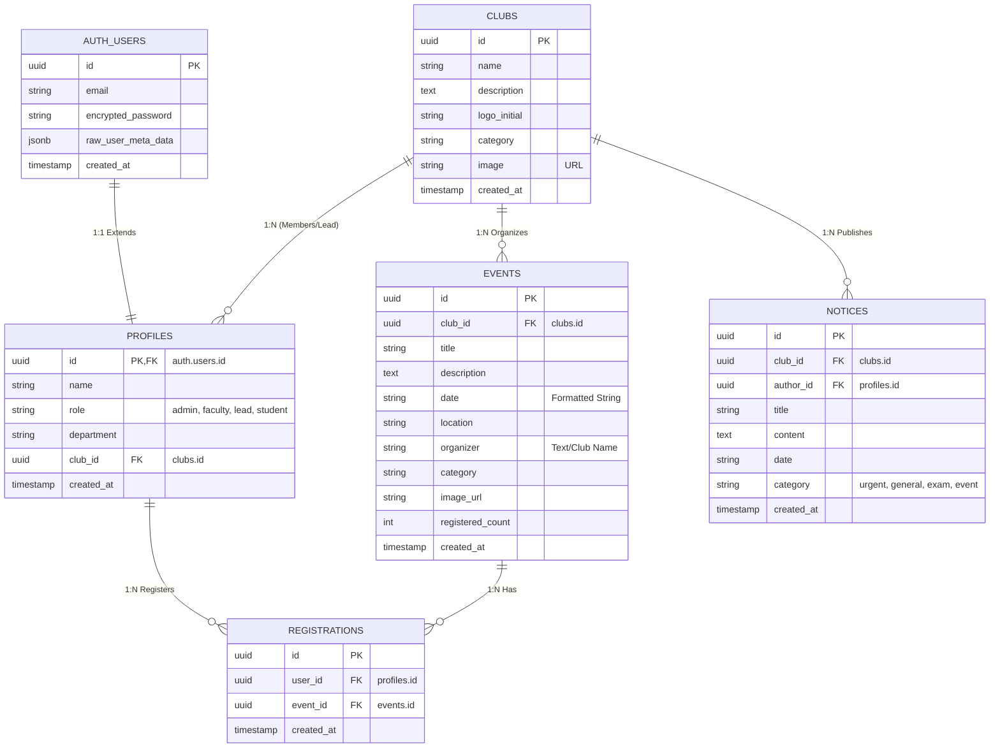
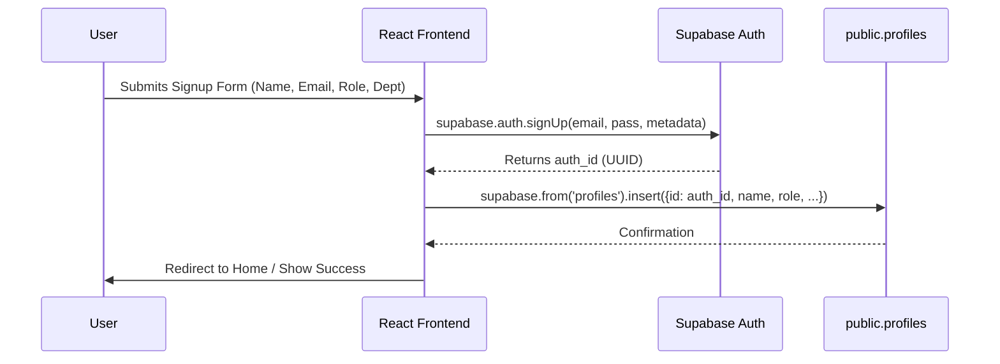
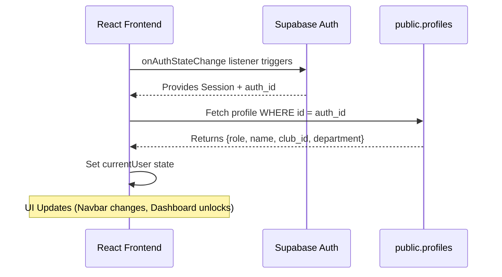

# PEC Portal - Database & Data Flow Architecture

This document provides a technical deep-dive into the relational structure and data movement within the PEC Portal ecosystem.

---

## 1. Entity Relationship (ER) Diagram

The following diagram illustrates the connections between the system-level authentication and the public application tables.



---

## 2. SQL Migration Script (Robust)

The following script handles existing data issues (like "c2" text IDs) by cleaning them up before converting columns to UUIDs.

**Run this in the Supabase SQL Editor:**

```sql
-- 0. CLEANUP: Handle invalid non-UUID data (e.g., 'c1', 'c2')
-- This prevents "invalid input syntax for type uuid" errors.

-- Set invalid club_ids in profiles to NULL
UPDATE public.profiles 
SET club_id = NULL 
WHERE club_id IS NOT NULL 
  AND club_id::text !~ '^[0-9a-fA-F]{8}-[0-9a-fA-F]{4}-[0-9a-fA-F]{4}-[0-9a-fA-F]{4}-[0-9a-fA-F]{12}$';

-- Delete clubs with invalid IDs (Mock data cannot be converted to UUID)
-- WARNING: This deletes clubs with IDs like 'c1', 'c2'. Re-create them after migration.
DELETE FROM public.clubs 
WHERE id::text !~ '^[0-9a-fA-F]{8}-[0-9a-fA-F]{4}-[0-9a-fA-F]{4}-[0-9a-fA-F]{4}-[0-9a-fA-F]{12}$';

-- 1. Connect Profiles to Clubs
-- Now safe to convert to UUID
ALTER TABLE public.profiles 
ALTER COLUMN club_id TYPE uuid USING club_id::uuid,
ADD CONSTRAINT fk_profiles_clubs FOREIGN KEY (club_id) REFERENCES public.clubs(id);

-- 2. Connect Events to Clubs
-- Add column if it doesn't exist
DO $$ 
BEGIN 
    IF NOT EXISTS (SELECT 1 FROM information_schema.columns WHERE table_name = 'events' AND column_name = 'club_id') THEN
        ALTER TABLE public.events ADD COLUMN club_id uuid REFERENCES public.clubs(id);
    END IF;
END $$;

-- 3. Connect Notices to Clubs and Authors
DO $$ 
BEGIN 
    IF NOT EXISTS (SELECT 1 FROM information_schema.columns WHERE table_name = 'notices' AND column_name = 'club_id') THEN
        ALTER TABLE public.notices ADD COLUMN club_id uuid REFERENCES public.clubs(id);
    END IF;
    IF NOT EXISTS (SELECT 1 FROM information_schema.columns WHERE table_name = 'notices' AND column_name = 'author_id') THEN
        ALTER TABLE public.notices ADD COLUMN author_id uuid REFERENCES public.profiles(id);
    END IF;
END $$;

-- 4. Create Registrations Table (Many-to-Many for Events)
CREATE TABLE IF NOT EXISTS public.registrations (
  id uuid DEFAULT gen_random_uuid() PRIMARY KEY,
  user_id uuid REFERENCES public.profiles(id) NOT NULL,
  event_id uuid REFERENCES public.events(id) NOT NULL,
  created_at timestamptz DEFAULT now(),
  UNIQUE(user_id, event_id)
);

-- 5. Create Memberships Table (Many-to-Many for Clubs)
CREATE TABLE IF NOT EXISTS public.memberships (
  id uuid DEFAULT gen_random_uuid() PRIMARY KEY,
  user_id uuid REFERENCES public.profiles(id) NOT NULL,
  club_id uuid REFERENCES public.clubs(id) NOT NULL,
  role text DEFAULT 'member',
  joined_at timestamptz DEFAULT now(),
  UNIQUE(user_id, club_id)
);

-- 6. Enable RLS
ALTER TABLE public.registrations ENABLE ROW LEVEL SECURITY;
ALTER TABLE public.memberships ENABLE ROW LEVEL SECURITY;

-- 7. RLS Policies (Drop first to avoid errors if re-running)
DROP POLICY IF EXISTS "Users can view their own registrations" ON public.registrations;
CREATE POLICY "Users can view their own registrations" ON public.registrations
  FOR SELECT USING (auth.uid() = user_id);

DROP POLICY IF EXISTS "Users can register themselves" ON public.registrations;
CREATE POLICY "Users can register themselves" ON public.registrations
  FOR INSERT WITH CHECK (auth.uid() = user_id);
```

---

## 3. Table Relationships & Logic

### 3.1. The Auth-Profile Link (1:1)
- **Primary Key Mapping:** Every row in `public.profiles` shares the exact same UUID as the corresponding row in `auth.users`.
- **Integrity:** If a user is deleted from the `auth` system, the `profiles` row is typically cleaned up or orphaned depending on the foreign key constraint (`ON DELETE CASCADE`).

### 3.2. The Club-Lead Mapping (1:N)
- **The `club_id` column:** In the `profiles` table, this column is used primarily for users with the `lead` role.
- **Dynamic Membership:** When calculating "Member Count," the application performs a lookup: `SELECT count(*) FROM profiles WHERE club_id = 'XYZ'`. This ensures that even "Student" users can be associated with a club if the UI allows joining.

### 3.3. Event & Notice Ownership (Logical)
- While the database currently stores `organizer` as a `TEXT` field in `events` for simplicity, it is logically derived from the `name` of the club the `lead` belongs to, or the `department` of a `faculty` member.

---

## 4. Data Flow Diagrams

### 4.1. User Registration Flow (Dual-Write)
This sequence ensures that a user exists both in the secure Auth system and the accessible Public Profile system.



### 4.2. Authentication & Hydration Flow
How the app "wakes up" and knows who you are.



---

## 5. Field Specification Details

| Table | Field | Type | Description |
| :--- | :--- | :--- | :--- |
| **profiles** | `role` | TEXT | Enforced via SQL check: `admin`, `faculty`, `lead`, `student`. |
| **profiles** | `club_id` | UUID | Foreign Key to `clubs`. Nullable. Essential for `lead` role to manage their club. |
| **notices** | `category` | TEXT | `urgent` triggers red styling; `exam` triggers blue; `event` triggers yellow. |
| **events** | `registered_count`| INT | Incrementing counter for interest tracking. |
| **clubs** | `image` | TEXT | Publicly accessible URL for the club banner. |

---

## 6. Security & Access Control (RLS Logic)

- **Admin/Faculty:** Can write to `notices` and `events`. Can read all `profiles`.
- **Club Lead:** Can update their specific `clubs` row where `id == user.club_id`. Can write to `events`.
- **Student:** Can read everything. Can only update their own `profiles` row.
- **Anonymous:** Can read `events`, `notices`, and `clubs` but cannot access `profiles` or write data.

